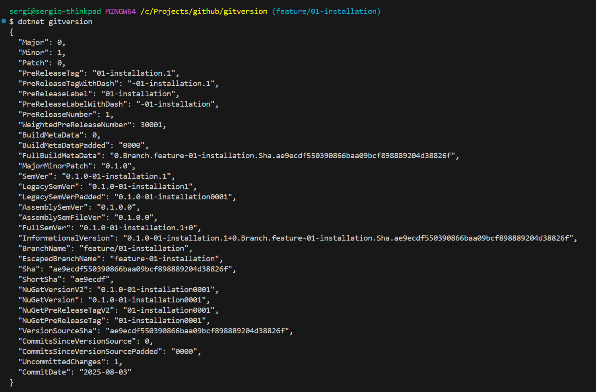

# GitVersion sample repository

This repository intend to explain the use of GitVersion as a solution con manage the version through PR/CI pipelines.

GitVersion is a tool that use the git repository history to calculate a [Semantic Version Number](https://semver.org/).

The version number generated can be used for different purposes, such as:

1. Stamping a version number to the compiled assemblies.
2. Stamping a version number on artifacts.
3. Expose the version number to set the build version.

GitVersion can be use on different ways

1. Continous integration server pipeline like Azure DevOps or GitHub actions.
2. Command line interface
3. MSBuild task
4. Nuget package library
5. Docker

In this example we are goint to focus on Continous Integration pipeline and command line interface

# GitVersion local installation

IMPORTANT: Be aware of GitVersion documentation becase is not to be aligned with the last version available on nuget package repository. This example will use the version 6.0.5. If you try to use the latest version, the gitversion configuration file in this repository might not work. 

The first thing we are going to do is to install GitVersion using dotnet cli. If you do not have dotnet cli installed you can install it from the [Official Microsoft dotnet site](https://dotnet.microsoft.com/en-us/download)

To install git version run the following command

```
dotnet tool install --global GitVersion.Tool --version 6.0.5
```

Alternatively, if you are using Mac, you can install it using homebrew

```
brew install gitversion
```

# Using GitVersion from command line

Once installed, you can use GitVersion directly from the command line in the root of your repository using the following command

```
dotnet gitversion
```



# GitVersion configuration

GitVersion has a default configuration that can be shown by executing the followin command

```
dotnet gitversion /showConfig
``` 

This configuration is in YAML format and is the configuration that is going to be used when executing git version. However, this configuration can be override with a configuration file on the root of the repository.

To read more about the [gitversion configuration](https://gitversion.net/docs/reference/configuration) please refer to the official gitversion configuration documentation

## GitVersion configuration file

As we mention, the gitversion configuration can be overrided by creating a configuration file named GitVersion.yml

In this example we are going to modify the default configuration to examinate how gitversion behaves depending of the branch we are located and the gitversion configuration. The first step is to run the command to show the configuration and create the configuration file. Before commit run the gitversion command (save the output) and commit the GitVersion.yml and run the gitversion command agin to compare the two outputs.

### Update behaviour 

You might probably have to modify your GitVersion.yml file depending of your requirements. For example on the configuration of this repository you will find that main main mode is configured and ManualDeployment which means that the version remain on the same pre-released version until it has been deployed dedicatedly, [Refer to the documentation for mure information](https://gitversion.net/docs/reference/modes/) and add label 'rev'.
